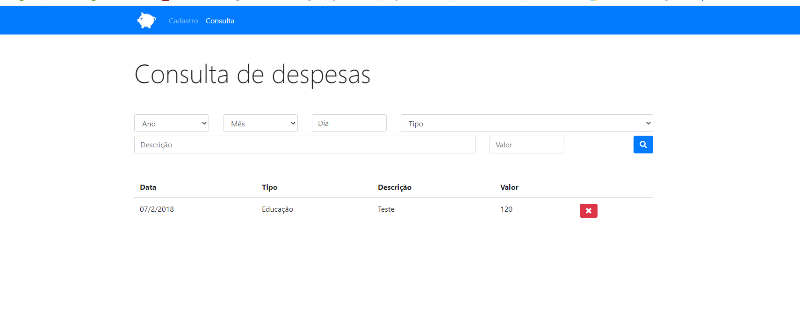

# CRUD desenvolvida afins didaticos

### Desenvolvida com as tecnologias: JSVanilla, HTML e CSS.
### Utilizamos o localStorage para guardar informações cadastradas.
### Esta CRUD possui 2 Pages, sendo a 1° de cadastro e a 2° de consulta.

